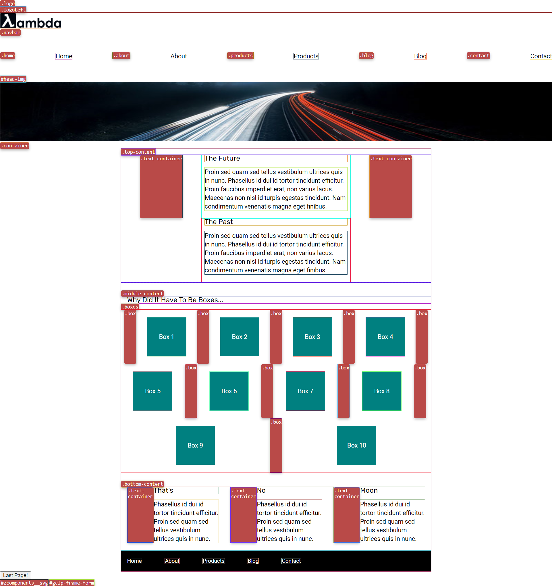
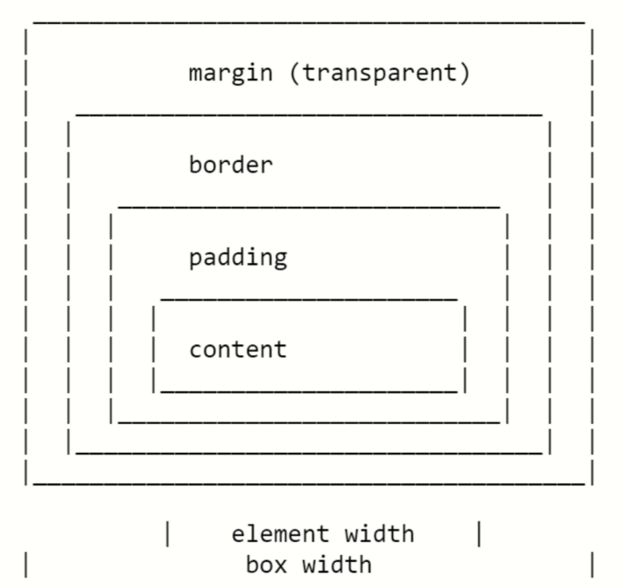
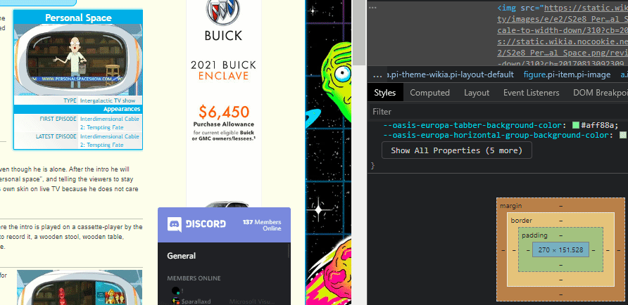
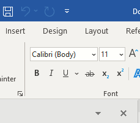

# Sprint Challenge: User Interface and Git - Multi-Page Website

# ✅=== ORIGINAL DIRECTORY STRUCTURE
```
tree
.
├── ✅README.md
├── UserInterfaceandGit-Multi-PageWebsite
│   ├── documentation-notes
│   │   ├── notes.css
│   │   ├── notes.md
│   │   ├── screencapture-127-0-0-1-5500-UserInterfaceandGit-Multi-PageWebsite-web-Sprint-Challenge-User-Interface-and-Git-index-html-2021-04-09-13_44_49.png
│   │   ├── screenshots
│   │   │   ├── block.PNG
│   │   │   ├── inline.PNG
│   │   │   ├── margin-border-edges.PNG
│   │   │   ├── micro.PNG
│   │   │   ├── oC5cxyw.gif
│   │   │   └── shishkabob.PNG
│   │   └── sprint-challenge-ui-home-example.png
│   ├── notes.html
│   └── web-Sprint-Challenge-User-Interface-and-Git
│       ├── ✅LICENSE
│       ├── ✅about.html
│       ├── css
│       │   └──✅ **index.css**
│       ├── design-files
│       │   ├── ✅**about.png**
│       │   └──✅ **home.png**
│       ├── img
│       │   ├──✅ about-meeting.png
│       │   ├──✅ about-office.png
│       │   ├── ✅about-plan.png
│       │   ├── ✅about-working.png
│       │   ├── ✅jumbo-about.png
│       │   ├── ✅jumbo.jpg
│       │   ├──✅ lambda-black.png
│       │   └── ✅pair-program.png
│       └── ✅index.html
├── index.html
└── makefile

###### HI 


```




This challenge allows you to practice the concepts and techniques learned over the past week and apply them in a concrete project. This Sprint explored User Interface and Git. During this Sprint, you studied Semantic HTML, CSS Fundamentals, CSS Flexbox Module, and Git. In your challenge this week, you will demonstrate proficiency by creating a multi page website that has some missing HTML elements as well as CSS specificity problems that need to be solved.  You will also create an additional web page that will be linked to from a navigation you will build.

## Instructions

**Read these instructions carefully. Understand exactly what is expected _before_ starting this Sprint Challenge.**

This is an individual assessment. All work must be your own. Your challenge score is a measure of your ability to work independently using the material covered through this sprint. You need to demonstrate proficiency in the concepts and objectives introduced and practiced in preceding days.

You are not allowed to collaborate during the Sprint Challenge. Your work reflects your proficiency in user interface and your command of the concepts and techniques in semantic HTML, CSS fundamentals, CSS flexbox module, and git.

## Commits

Commit your code regularly and meaningfully. This helps both you (in case you ever need to return to old code for any number of reasons)

## Description

In this challenge, you build a missing header (navigation and image) on the home page, update some CSS styling on the home page, and create an additional page (About) which will link from the navigation you created.

In meeting the minimum viable product (MVP) specifications listed below, your web page should look like the solution screen shots of the home and about pages (found in the design-files folder):

[Click here for the home page example](https://tk-assets.lambdaschool.com/39a49225-8ac9-43da-aa90-514fd60ae99a_sprint-challenge-ui-home-example.png)

[Click here for the about page example](https://tk-assets.lambdaschool.com/ede1bb1a-63ff-4801-8c02-3efa2f603190_sprint-challenge-ui-about-example.png)

## Self-Study Questions 

### (please edit this file and write your answer below each question. In addition, you may also review these questions with your mentor)

Demonstrate your understanding of this week's concepts by answering the following free-form questions.

Edit this document to include your answers after each question. Make sure to leave a blank line above and below your answer so it is clear and easy to read.

## Self-Study Questions 

## Answer the following free-form questions.

_Edit this document to include your answers after each question. Make sure to leave a blank line above and below your answer so it is clear and easy to read._

<span style="color:red; ">1. If you were to describe semantic HTML to the next cohort of students, what would you say?</span>

> When optimizing a webpage to be easily accessed and indexed by a search engine we use HTML tags to tell browsers something qualatative about the contents of the element to the human end user, while still maintaning a syntax that the computer will eventually interpret as ones and zeros. Rather than just serving as the proverbial scaffolding of  content to be rendered on a web page, the tags serve the dual purpose of conveying both meaning of individual components and thus their utility to a human entering a paticular search queuery.. In the absence of this discipline every webpage would be a meaningless soup of div's span's, images and iframes ... etc.. without giving the browser any inclination of whether or not the content stored within the media is relivant to the user. Some examples are the **\<section>** tag which has no MIME-type specific purpose other than to break content up into logical subdevisions based on the subject matter  contained within and it's distinction from the other sections ... or the \<h1> tag; which while syntactically permissible to reuse throughout a webpage, defeats the purpose of titling your page so that it can be found by those who seek it out.

---
<span style="color:red; ">2. Name two big differences between ` ` ` display: block; ` `  ` and `  ` ` display : inline; ` ` `.</span>

> display **block**:

* means that the element is in chuncks simalar to paragraphs.  A block has some whitespace above and below it and will not tollerate horizontally adjacent elements with the exception of an explicit css rule. For instance, one exception to this _heueristic_ rule is if one of it's directly adjcent upper or lower neighbours was captured by a float declaration.


> display **inline**:

* Denotes the near opisite of display block in terms of it's tollerent horizontal disposition to it's neighbours inside of the current block (on the same line). Only when it's between two blocks does the element form an 'anonymous block', that however has the smallest possible width.


---
<span style="color:red; ">3. What are the 4 areas of the box model?</span>

>


#### [When laying out a document, the browser's rendering engine represents each element as a rectangular box.](https://developer.mozilla.org/en-US/docs/Web/CSS/CSS_Box_Model/Introduction_to_the_CSS_box_model)

> Source: MDN

> Every box is composed of four parts:
> ⦾→→→          **defined by their respective edges**: 
>  

* [ ] > **the content edge**
* [ ] > **padding edge**
* [ ] > **border edge**
* [ ] > **margin edge**

> The margin edge surrounds the box's 'personal space'.

* If the margin has 0 width, →→→ the margin edge synonymus with border edge. The four margin edges define the box's margin box . Each edge may be broken down into a top, right, bottom, and left edge.

<div align="center">



</div>

#####  I like to think of padding, as a someone (_on halloween_) riding the bus with a very bulky costume on... say for instance a kissing booth. The content the person inside, but when if you have no choice but to try to sit on the fraction of a seat beside them despite your now  abnormally contricted personal space, 


 you'll likley give them even more clearance as a sudden jolt of the bus could result in an awkward collision. If the outside of a costume is the border, the margin is then how far away is how much clearance that buffer of space demands. Margin takes social distancing seriously... be like margin.

  + `padding` - the innermost part of the box model -- creating space around an element's content before its border.

   - `margin` - the space between one html element and another html element

  + One thing to note is that margins will collapse. If I'm comfortable with being 10 pixels away from my neighbor but my neighbor wants to be 15 pixels away from everyone, overall we are going to be 15 pixels away. I don't need an extra 10 pixels for myself, 15 pixels satisfy both of our requests.

<div align="center">



</div>

---

<span style="color:red; ">4. While using flexbox, what axis does the following property work on: ` ` ` align-items: center ` ` `?</span>


>align-items is essentially the equivalent to  justify-content but perpendicular in their respective axis.
- align-items:
> Defines how flexbox items are aligned according to the cross axis, within a row of a flexbox container.
- The flexbox items are aligned at the center of the cross axis (verticle or y-axis).

### This means the flexbox items will be centered vertically( like a shishkabob held orthagonally to the face of a very hungry Lambda student)

i.e.:


---
<span style="color:red; ">5. Explain why git is valuable to a team of developers.</span>

## Suffice it to say that despite it being partially culpiable the ever so slight balding that has begun for me this year, I feel so passionatly about the utility and potential for GIT-~~HUB~~ and what it stands for that I wrote a '37 minute long  read ' Medium article about it.

[my medium article](https://levelup.gitconnected.com/understanding-git-a-beginners-guide-containing-cheat-sheets-resources-b50c9c01a107)
 
>Git is an example of a distributed version control system (DVCS) commonly used for open source and commercial software development. DVCSs allow full access to every file, branch, and iteration of a project, and allows every user access to a full and self-contained history of all changes.  --GitHub Docs

> I know that in the context of a team there are certainly more important features than the one I am about to mention ... but I think the notion of storing version history as a series of diffs rather than standalone snapshots of the entire repository at every commit is brilliantly efficient. Software development is a complex, tedious, and ...luckily for us, costly affair. Hours up to years worth of work, can be severely damaged or destroyed in less time than a synapse can fire  from the optic nerve to the brain. I imagine that during the primordial time that ostensibly predated modern version control, such situations did arise.. and some unfortunate programmers did stare up into the sky, questioning every decision they ever made wearing a defeated gaze. Today we live in a world where teams can come together to work on a shared goal from any corner of the globe. Without version control, team members are subject to redundant tasks, slower timelines, and multiple copies of a single project. To eliminate unnecessary work, Git and other VCSs give each contributor a unified and consistent view of a project, surfacing work that's already in progress. According to the latest Stack Overflow developer survey, more than 70 percent of developers use Git, making it the most-used VCS in the world. I don't even have a clue what came before it....




>Finally, I'd like to touch on what I consider to be There's a "Golden Rule of Git" you should know that directly relates to both git reset and git rebase:
# Never change the history of a branch that's shared with others.


>Git's most prolific feature is the ability to work with virtually infinite parallel histories that can be used to explore a potential feature or work out a bug and than provides a reliable way to merge them together on an enterprise scale.

---
---
---


# Project Set Up

* [ ✅] Create a forked copy of this project.
* [ ] Clone your OWN version of the repository (Not Lambda's by mistake!).
* [ ] Create a new branch: git checkout -b `<firstName-lastName>`.
* [ ] Implement the project on your newly created `<firstName-lastName>` branch, committing changes regularly.
* [ ] Push commits: git push -u origin `<firstName-lastName>`.

 
Follow these steps for completing your project.

* [ ] Submit a Pull-Request to merge <firstName-lastName> Branch into master (student's  Repo). **Please don't merge your own pull request**

## Minimum Viable Product

Your finished project must include all of the following requirements:

### Home Page

[Review the provided design file for the home page](design-files/home.png).  Notice the navigation and header images are missing.

* [ ] Build the HTML and CSS to create the missing navigation and header.
* [ ] Link the `About` navigation item to the [about.html](about.html) page

You will also notice there are 10 boxes on the home page that need background colors.  Use this list below to correctly style each box:

* [ ] box1: `teal`
* [ ] box2: `gold`
* [ ] box3: `cadetblue`
* [ ] box4: `coral`
* [ ] box5: `crimson`
* [ ] box6: `forestgreen`
* [ ] box7: `darkorchid`
* [ ] box8: `hotpink`
* [ ] box9: `indigo`
* [ ] box10: `dodgerblue`

```css

.box-1 {
  background-color: teal;
}

.box-2 {
  background-color: gold;
}

.box-3 {
  background-color: cadetblue;
}

.box-4 {
  background-color: coral;
}

.box-5 {
  background-color: crimson;
}

.box-6 {
  background-color: forestgreen;
}

.box-7 {
  background-color: darkorchid;
}

.box-8 {
  background-color: hotpink;
}

.box-9 {
  background-color: indigo;
}

.box-10 {
  background-color: dodgerblue;
}


```

### About Page

[Review the provided design file for the about page](design-files/about.png). You have been provided the HTML wrapper, footer, and page content for the about page. Create the rest of the missing HTML and CSS to match the design file.

* [ ] Copy and paste your home page navigation and header into the about page
* [ ] Update the header image with the about page image
* [ ] Link the `Home` navigation item back to the `index.html` page.
* [ ] Build the rest of the about page layout to match the design

In your solution, it is essential that you follow best practices and produce clean and professional results. Schedule time to review, refine, and assess your work and perform basic professional polishing including spell-checking and grammar-checking on your work. It is better to submit a challenge that meets MVP than one that attempts too much and does not.

Note: Please make sure you are using flexbox to layout your website. Floats, inline-block, tables, etc, should not be used for layout. 

## Stretch Problems

After finishing your required elements, you can push your work further. These goals may or may not be things you have learned in this module but they build on the material you just studied. Time allowing, stretch your limits and see if you can deliver on the following optional goals:

* [ ] refactor your HTML, make sure it's indented properly, clean, readable, you have written appropriate comments where necessary and that all attributes (required and encouraged) are filled out correctly.  
* [ ] Ensure your CSS is organized and readable, you've seperated your code by section and that you are using descriptive class names and adding classes in your HTML where styles repeat rather than rewrting the same styles over again
* [ ] Use a flex item property of your choice when laying out a section of your website, ensure you can explain how and why you've used this property 
